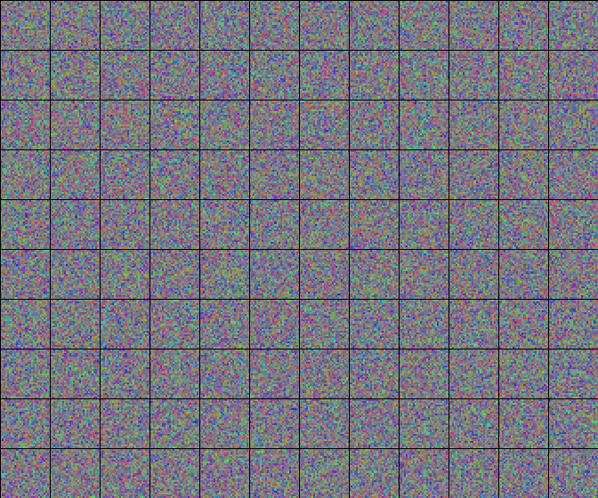
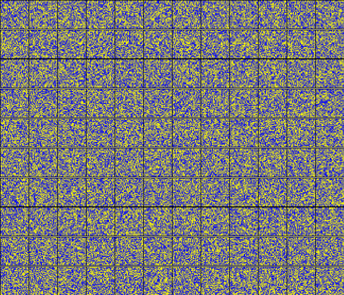
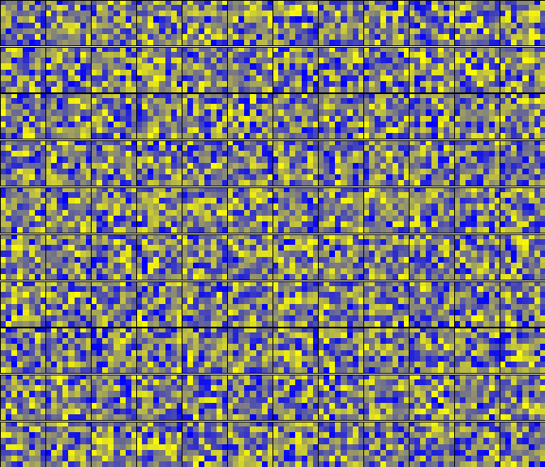

# Binding by Reconstruction Clustering

This is the code repository complementing the paper ["Binding by Reconstruction Clustering"](http://arxiv.org/abs/1511.06418).

## Demo Images
Here are some animations of the convergence behaviour of Reconstruction Clustering.

### Shapes

### Multi MNIST

### Corners

### Bars

### MNIST + Shape

### Simple Superposition

## Dependencies and Setup

* brainstorm == 0.5
* numpy >= 1.8
* matplotlib >= 1.5
* seaborn >= 0.6
* sacred >= 0.6.7
* jupyter
* ipython
* pymongo
* h5py
* sklearn
* pandas

Make sure you have a MongoDB running locally.
Make sure you have set the `BRAINSTORM_DATA_DIR` environment variable.

## Preparing the data
First run all of the jupyter notebooks in the `Dataset` directory. 
This will create HDF5 files for all datasets and save them in your `BRAINSTORM_DATA_DIR`.

## Random Search
If you want to run the random search for good hyperparameters yourself you can 
run the file ``run_random_search.py``. 
It will perform 100 runs of random search for each of the datasets and save the
results to the local MongoDB database.
But be warned: This might take a couple of days!

You can then look at the results using the `Get_Search_Results.ipynb` notebook.

## Train best Networks
To get the best networks we used in the paper for each dataset run `run_best_nets.py`.
It will save a `Networks/DATASET_best_dae.h5` network for each dataset. This shouldn't take more than half an hour.

Alternatively you can use your own best results from the random search by running the 
last cell in the `Get_Search_Results.ipynb`.

These files are needed for the following steps.

## Evaluation 
Next we use these networks for Reconstruction Clustering and store all of the results for later analysis.

    run_evaluation.py

NOTE: This should take about an hour and use about 26 GBytes of disk space.

## Plots
The `Plots.ipynb` notebook generates all the figures used in the paper.
Once you've run all the other steps you should be able to able to generate them
all yourself.

